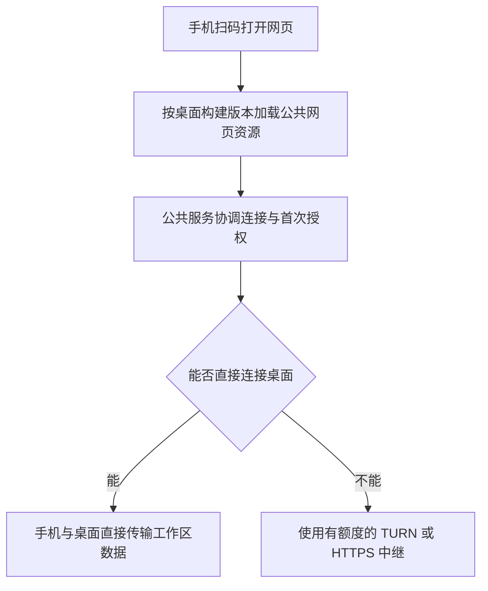

# 远程服务的低成本上线与收入规划

核对日期：2026-10-05。本文是规划，不代表 P2P、Cloudflare Relay、计费或额度控制已经实现。价格以供应商当前账单及官方条款为准；金额使用美元原价，不预设汇率。

## 推荐顺序

先复用现有京东云服务器，减少经过它的数据：按构建版本分发公开网页资源，手机与桌面优先通过 WebRTC DataChannel 直接通信。直连失败才使用托管 TURN 或现有 HTTPS Relay。Cloudflare Workers / Durable Objects 适合后续承接连接协调，先从免费额度或最低付费档开始，不购买大带宽云主机。

普通用户继续使用“桌面开启 → 手机扫码 → 首次批准 → 继续同一工作区”的流程，连接方式自动选择。自建节点是可选功能，公共默认服务要能独立完成该流程。

初期以**新增固定支出接近零、月度总新增支出目标不超过 100 元人民币**做规划。这个数字是预算目标，不能当作供应商的套餐上限或万名活跃用户的成本承诺。付费服务、账单限额和商业定价仍需由项目负责人确定。

## 现状与需要改变的路径

当前 `packages/remote-relay/src/index.ts` 使用 Bun 服务和进程内连接映射；桌面通过 WSS 连接它，浏览器的 HTTP、事件流和 WebSocket 请求再转发给桌面本机服务。没有 WebRTC/P2P 通道，首次访问的 JS、CSS、字体等也经过中继。浏览器缓存可以减少重复下载，不能免去第一次下载。

既有服务器为 2 核 / 8 GB / 5 Mbps，Relay 容器限制为 1 CPU / 512 MiB。`maxSessions = 10000` 是准入保护值，不能证明该配置支持一万活跃用户。

建议的路径：

- **网页资源**：部署公开的正式构建，内容寻址、长缓存；使用桌面报告的精确 build ID 和协议版本。不能随意加载 CDN 的 latest，否则旧桌面或开发版可能使用不兼容页面。开发构建未发布 CDN 时保留本机资源回退。
- **连接协调**：公共服务处理二维码、审批、浏览器授权及 WebRTC 地址交换。这类小消息称为信令，不持续承载会话正文。保留已有授权语义，避免切换链路后重新批准或创建空白工作区。
- **P2P**：会话、消息、文件请求、SSE 和终端流量通过加密 DataChannel 传输；覆盖 SDK 的 fetch 和终端 WebSocket，不只替换一个 fetch 函数。断线后自动恢复；只有最终直连路径成功时，才报告“直连”。
- **回退**：TURN 负责 WebRTC 直连失败后的加密数据转发；现有 HTTPS Relay 作为协议/网络兼容回退。TURN 与当前自写的 HTTP Relay 是两种不同实现，不能仅改 URL 就替换。
- **同一工作区**：无论传输路径如何选择，后端仍是该用户自己的桌面本机服务；不把项目和对话复制成云端的独立工作区。

## 可以使用的免费额度

| 服务 | 核对到的免费额度/起步价 | 适合承担什么 |
| --- | --- | --- |
| Workers Static Assets | 静态资源请求免费且不限请求数量 | 正式 Web UI 的 JS、CSS、字体与入口页 |
| Workers | 免费 10 万次动态请求/天、每次 10 ms CPU；付费最低 $5/月，无另外的出站流量或带宽费用 | 连接入口、路由、授权接口 |
| Durable Objects | 免费 10 万次计算请求/天、13,000 GB-s/天；付费包含 100 万次/月、400,000 GB-s/月，超额分别 $0.15/百万次、$12.50/百万 GB-s | 协调属于同一桌面的多个连接与授权状态 |
| Realtime TURN | 每月前 1,000 GB 出站免费，与 SFU 共享；超额 $0.05/GB | WebRTC 直连失败时的托管数据转发 |

来源：[Workers 定价](https://developers.cloudflare.com/workers/platform/pricing/)、[Durable Objects 定价](https://developers.cloudflare.com/durable-objects/platform/pricing/)、[Realtime 定价](https://developers.cloudflare.com/realtime/sfu/platform/pricing/)。

这些是不同产品的额度。Workers 的无出站费用不能套用到 TURN；网页免费托管不能消除私有会话的传输成本。Workers/DO 的 CPU、计算时长、请求和持久化存储仍可能收费。免费 DO 超额度会使相应操作失败，不适合把无限制公共服务建立在免费额度不会耗尽的假设上。

当前 Relay 不能原样上传 Workers：Bun 服务、Node 文件读写和跨连接状态需要适配。普通 Worker 全局变量不能可靠地连接两次独立请求中的桌面与手机；通常要使用 DO 做协调。只在京东云 Relay 前套 Worker 反向代理，京东云仍需向它发送全部数据，5 Mbps 瓶颈依旧存在。

DO 迁移需要使用可休眠 WebSocket，授权持久化，空闲时不维持应用计时器。持续活跃对象按分配的 128 MB 计算 GB-s，与实际内存占用无关。当前 30 秒一次的应用心跳，在一万台桌面全天在线时有 2,880 万条消息/天；即使按官方 20:1 计算折算，也达到 144 万次/天，超过 10 万免费请求。不能把旧心跳协议直接搬过去就宣称永久免费。

来源：[Worker WebSocket 的协调边界](https://developers.cloudflare.com/workers/runtime-apis/websockets/)、[DO WebSocket 休眠](https://developers.cloudflare.com/durable-objects/best-practices/websockets/)、[DO 计算计费](https://developers.cloudflare.com/durable-objects/platform/pricing/)。

## 中国大陆与海外的体验

Cloudflare 全球免费/普通付费网络不等于中国大陆加速网络。China Network 是 Enterprise 的单独订阅；Realtime TURN 的官方地域说明明确排除 China Network。不能承诺免费节点在中国大陆所有运营商下都稳定。

初期保留京东云的国内连接入口和兼容回退，海外评估 Cloudflare 节点。通过连接成功率和耗时自动选择路径，优先保住“一键扫码”。同一桌面会话必须始终归属同一协调节点，跨地域切换要有授权交接设计，不能在两个节点分别新建会话导致丢项目或重复批准。

正式推广前分别观察大陆电信、联通、移动网络及美国网络的连接成功率、首次首屏时间、会话打开耗时和回退比例。没有这些结果时不能标记“全球稳定”。节点赞助优先争取国内带宽及海外回退区域，不预先购买 Enterprise 网络。

来源：[China Network 可用性](https://developers.cloudflare.com/china-network/)、[TURN 地域说明](https://developers.cloudflare.com/realtime/turn/)。

## 成本怎么估算

分开统计注册用户、在线桌面、正在使用的远程浏览器和实际走中继的连接。收费流量主要取决于最后一项的数据量及使用时间。

以下只是算例：每个活跃用户的双向应用数据合计平均 **10 KB/s**，每天使用 **1 小时**，一个月 **30 天**，其中 **80% 的数据量走直连**、20% 走 TURN。用十进制 KB/GB，暂按这些中继数据等于计费出口估算，不包含协议开销与重试；实际应累加所有 Cloudflare → TURN 客户端的出站，不能仅统计桌面发送正文。直连比例和流量都需要实测。

| 每天同时使用的用户数 | 总应用流量/月 | 走 TURN 的流量/月 | TURN 估算费用/月 |
| --- | --- | --- | --- |
| 1,000 | 1,080 GB | 216 GB | $0 |
| 10,000 | 10,800 GB | 2,160 GB | $58 |

计算：`用户数 × 平均字节/秒 × 每天使用秒数 × 30 × 中继数据占比 ÷ 1,000,000,000`。TURN 费用为 `max(0, 月出站 GB - 1000) × $0.05`，假定免费额度没有被同账户其他 SFU/TURN 应用消耗。这不是总账单，另有连接协调、存储和可能的节点费用。计费出口定义见 [TURN FAQ](https://developers.cloudflare.com/realtime/turn/faq/)。

同样一万用户如果 **24 小时持续传输**，20% TURN 对应 51,840 GB/月，TURN 单项约 **$2,542/月**。所以一万注册用户与一万全天活跃中继用户的成本差别很大，不能承诺后一种永久免费。

在上述 10 KB/s 假设下，一万用户同时活跃约需 800 Mbps 应用带宽，20% 中继仍约需 160 Mbps。5 Mbps 服务器作为全量中继只能容纳约 62 个这样的持续流量源，且这是未扣除开销的理论上限；不是实测容量。减少中继数据占比比把代码保护值设成一万更有效。

## 单人维护的支出控制

1. 每个连接分别统计直连/TURN/HTTP Relay 的字节量、使用时间、失败原因、重试数和首屏耗时；只记录技术指标，不留对话正文。当前 `/healthz` 的 `viewerOut` 为压缩前正文，汇总只覆盖尚存会话，删除会话或进程重启会使总量降低，不能直接用它当计费出口。应同时记录单调累计量及压缩后的网络出口，再与供应商账单口径对照。
2. 免费中继按月提供明确额度，P2P 使用不扣公共中继额度。初期试行额度需根据真实使用量定，再决定是否引入账号；当前只有浏览器授权，不能当成可信的用户计费身份。
3. 公共服务实行总预算、每用户额度和短期速率限制。达到阈值前提示，阈值后拒绝新的超额中继并给出购买额度/自建节点路径，直连继续使用。不能让界面无提示白屏。
4. TURN 使用后台生成的短时凭据，避免把长期密钥放进客户端。凭据在有效期内仍能产生费用，预算控制需考虑续签间隔、活动连接和供应商用量统计延迟；不能把账单告警当成硬封顶。
5. 公布每月流量、直连比例和节点赞助费用，按真实瓶颈决定扩容。建立小流量灰度，先验证跨网和故障恢复，再逐步放量。

## 收入安排

### 先争取资源赞助

向国内云厂商/主机商及开发者工具供应商争取一个国内回退节点或带宽额度，以官网鸣谢、每月真实技术指标和明确期限回报。先准备项目演示、开源许可证、活跃量、地区分布、中继流量和具体需求，再联系。不要只用“一万用户”估计数字要求无限流量。

Cloudflare Project Alexandria 可申请年度 Workers/Pages/R2 等额度，但当前申请页要求认可的 OSS 许可证和**完全非营利运营**。未来有付费托管服务时要如实披露并核实资格，不能把尚未批准的赞助计入预算，也不能照搬早期 Pro 免费升级的旧说明。

国内可先放自愿赞赏入口和透明成本报告。GitHub Sponsors 的当前直接收款地区列表没有中国大陆，不能默认该账号可以直接收款或伪造所在地。赞助是补充收入，不把它作为持续服务唯一资金来源。

来源：[Project Alexandria 申请](https://www.cloudflare.com/lp/project-alexandria/)、[GitHub Sponsors 支持地区](https://docs.github.com/en/sponsors/getting-started-with-github-sponsors/about-github-sponsors)。

### 再销售托管服务

- **免费**：开源桌面、CLI、手机页面、直接连接和自建能力，公共中继有清楚的试用额度。普通用户仍能完成完整工作流程。
- **个人托管**：试运营价格可以从 **19 元/月**、包含 **10 GB/月公共中继**起步，销售免维护的节点服务及额外额度；实际定价要覆盖支付费用、国内线路成本和支持成本，不卖“无限中继”。付费依旧自动优先使用直连。
- **企业服务**：后续根据付费需求提供组织授权管理、专属节点部署和维护，按部署项目/维护周期收款；首个客户验证需求后再开发，避免提前堆企业功能。

不承担所有用户的模型调用费。用户继续使用自己的模型服务配置；只有未来明确设计了成本核算、额度和支付后才考虑模型转售。用户的代码、对话和密钥不作为收入来源。

例如 100 位个人用户 × 19 元/月 = 1,900 元/月**毛收入**，并非利润，也非付费转化承诺。核算需要扣除节点、中继、支付、退款、支持时间及其他实际支出。

## 实施里程碑

| 阶段 | 可交付结果 | 支出决定 |
| --- | --- | --- |
| 1 | 修正多用户隔离，测量流量与耗时，减少重复下载和轮询 | 复用既有服务器 |
| 2 | 精确构建版本的公开资源分发，完整 P2P 请求/流支持，兼容回退 | 使用免费托管与 TURN 额度，验证大陆跨网 |
| 3 | 按真实用量加入预算、配额和地域路由，必要时迁移休眠 DO | 额度不足再评估 $5/月起的 Workers；总体费用单独核算 |
| 4 | 公布成本报告、准备节点赞助材料；有真实需求后试运营托管订阅 | 用收入与资源赞助承担新增回退容量 |

每阶段都要保留桌面和远程同一份会话数据，连接/等待/失败有即时反馈。指标达标之前，不以“改了容量常量”或“免费套餐不限带宽”作为上线容量证据。
