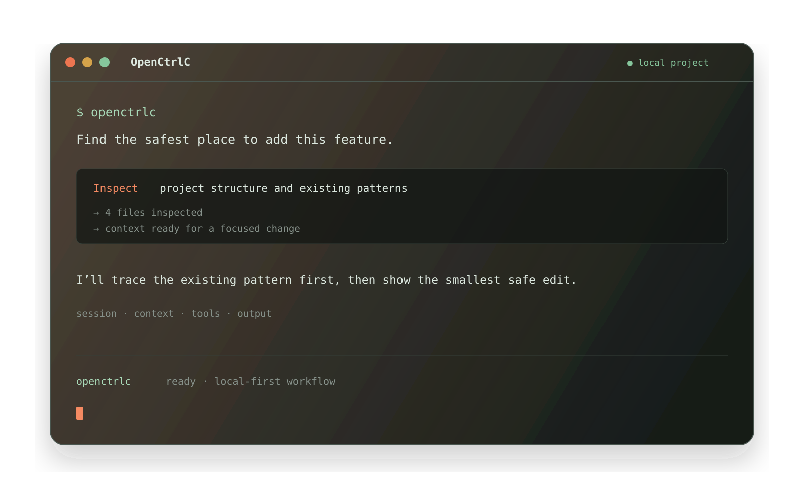

import config from "../../../../config.mjs"
export const console = config.console

[**openctrlc**](/) é um agente de codificação de IA de código aberto. Está disponível como uma interface baseada em terminal, aplicativo desktop ou extensão de IDE.



Vamos começar.

---

#### Pré-requisitos

Para usar o openctrlc no seu terminal, você precisará de:

1. Um emulador de terminal moderno como:
   - [WezTerm](https://wezterm.org), multiplataforma
   - [Alacritty](https://alacritty.org), multiplataforma
   - [Ghostty](https://ghostty.org), Linux e macOS
   - [Kitty](https://sw.kovidgoyal.net/kitty/), Linux e macOS

2. Chaves de API para os provedores de LLM que você deseja usar.

---

## Instalação

The installer script detects the current operating system and CPU architecture.

```bash
curl -fsSL https://raw.githubusercontent.com/ponponon/openctrlc/dev/install | bash
```

For platform-specific packages, use the [OpenCtrlC download page](https://openctrlc.pages.dev/download/) or [GitHub Releases](https://github.com/ponponon/openctrlc/releases). Stable downloads use the project's Cloudflare R2 mirror when available and automatically fall back to GitHub.

---

## Configuração

OpenCtrlC is a client application. Configure an LLM provider that you control; OpenCtrlC does not provide a hosted model service.

1. Run `/connect` in the TUI and select a supported provider. See [Providers](/docs/providers).

   ```txt
   /connect
   ```

2. Follow the provider's setup guide and paste its API key when prompted.

---

## Inicialização

Agora que você configurou um provedor, pode navegar até um projeto no qual deseja trabalhar.

```bash
cd /path/to/project
```

E execute o openctrlc.

```bash
openctrlc
```

Em seguida, inicialize o openctrlc para o projeto executando o seguinte comando.

```bash frame="none"
/init
```

Isso fará com que o openctrlc analise seu projeto e crie um arquivo `AGENTS.md` na raiz do projeto.

:::tip
Você deve commitar o arquivo `AGENTS.md` do seu projeto no Git.
:::

Isso ajuda o openctrlc a entender a estrutura do projeto e os padrões de codificação utilizados.

---

## Uso

Agora você está pronto para usar o openctrlc para trabalhar em seu projeto. Sinta-se à vontade para perguntar qualquer coisa!

Se você é novo no uso de um agente de codificação de IA, aqui estão alguns exemplos que podem ajudar.

---

### Fazendo perguntas

Você pode pedir ao openctrlc para explicar a base de código para você.

:::tip
Use a tecla `@` para buscar arquivos no projeto.
:::

```txt frame="none" "@src/api/index.ts"
How is authentication handled in @src/api/index.ts
```

Isso é útil se houver uma parte da base de código na qual você não trabalhou.

---

### Adicionando recursos

Você pode pedir ao openctrlc para adicionar novos recursos ao seu projeto. Embora primeiro recomendemos pedir para ele criar um plano.

1. **Criar um plano**

   O openctrlc tem um _Modo de Plano_ que desabilita sua capacidade de fazer alterações e, em vez disso, sugere _como_ implementará o recurso.

   Mude para ele usando a tecla **Tab**. Você verá um indicador para isso no canto inferior direito.

   ```bash frame="none" title="Switch to Plan mode"
   <TAB>
   ```

   Agora vamos descrever o que queremos que ele faça.

   ```txt frame="none"
   When a user deletes a note, we'd like to flag it as deleted in the database.
   Then create a screen that shows all the recently deleted notes.
   From this screen, the user can undelete a note or permanently delete it.
   ```

   Você quer dar ao openctrlc detalhes suficientes para entender o que você deseja. Ajuda conversar com ele como se você estivesse falando com um desenvolvedor júnior da sua equipe.

   :::tip
   Dê ao openctrlc bastante contexto e exemplos para ajudá-lo a entender o que você deseja.
   :::

2. **Iterar sobre o plano**

   Uma vez que ele lhe der um plano, você pode dar feedback ou adicionar mais detalhes.

   ```txt frame="none"
   We'd like to design this new screen using a design I've used before.
   [Image #1] Take a look at this image and use it as a reference.
   ```

   :::tip
   Arraste e solte imagens no terminal para adicioná-las ao prompt.
   :::

   O openctrlc pode escanear qualquer imagem que você fornecer e adicioná-la ao prompt. Você pode fazer isso arrastando e soltando uma imagem no terminal.

3. **Construir o recurso**

   Uma vez que você se sinta confortável com o plano, volte para o _Modo de Construção_ pressionando a tecla **Tab** novamente.

   ```bash frame="none"
   <TAB>
   ```

   E peça para ele fazer as alterações.

   ```bash frame="none"
   Sounds good! Go ahead and make the changes.
   ```

---

### Fazendo alterações

Para alterações mais simples, você pode pedir ao openctrlc para construí-las diretamente sem precisar revisar o plano primeiro.

```txt frame="none" "@src/settings.ts" "@src/notes.ts"
We need to add authentication to the /settings route. Take a look at how this is
handled in the /notes route in @src/notes.ts and implement
the same logic in @src/settings.ts
```

Você quer ter certeza de fornecer uma boa quantidade de detalhes para que o openctrlc faça as alterações corretas.

---

### Desfazendo alterações

Vamos supor que você peça ao openctrlc para fazer algumas alterações.

```txt frame="none" "@src/api/index.ts"
Can you refactor the function in @src/api/index.ts?
```

Mas você percebe que não era isso que você queria. Você **pode desfazer** as alterações usando o comando `/undo`.

```bash frame="none"
/undo
```

O openctrlc agora reverterá as alterações que você fez e mostrará sua mensagem original novamente.

```txt frame="none" "@src/api/index.ts"
Can you refactor the function in @src/api/index.ts?
```

A partir daqui, você pode ajustar o prompt e pedir ao openctrlc para tentar novamente.

:::tip
Você pode executar `/undo` várias vezes para desfazer várias alterações.
:::

Ou você **pode refazer** as alterações usando o comando `/redo`.

```bash frame="none"
/redo
```

---

## Compartilhamento

As conversas que você tem com o openctrlc podem ser [compartilhadas com sua equipe](/docs/share).

```bash frame="none"
/share
```

Isso criará um link para a conversa atual e o copiará para sua área de transferência.

:::note
As conversas não são compartilhadas por padrão.
:::

Aqui está uma [conversa de exemplo](https://openctrlc-docs.pages.dev/docs/share/) com o openctrlc.

---

## Personalização

E é isso! Agora você é um profissional em usar o openctrlc.

Para torná-lo seu, recomendamos [escolher um tema](/docs/themes), [personalizar os atalhos de teclado](/docs/keybinds), [configurar formatadores de código](/docs/formatters), [criar comandos personalizados](/docs/commands) ou brincar com a [configuração do openctrlc](/docs/config).
